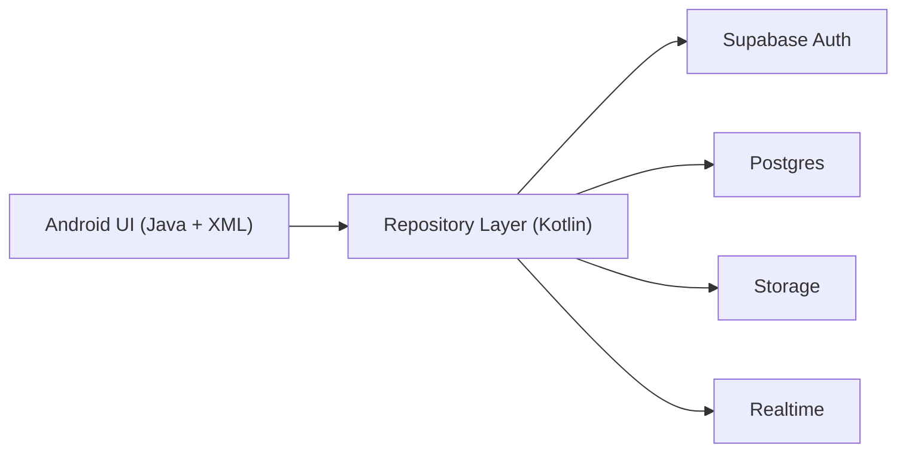

# Friend Finder

Friend Finder is a full-stack Android dating application that recreates the core swipe-to-match experience with a live backend. Users can create an account, publish a profile with photos, browse other profiles, like or pass with gesture-driven cards, form mutual matches, and exchange messages in real time.

The project combines a Java-based Android UI with a Supabase-powered backend. It is structured to demonstrate product thinking, mobile UI implementation, backend integration, realtime data flow, and security-conscious configuration management.

## Features

- Email/password account registration and sign-in
- Profile creation with name, age, city, job title, headline, bio, interests, and photos
- Cloud-hosted image uploads for profile photos
- Swipe left and swipe right discovery flow
- Mutual-like matching logic
- Realtime matches list with recent message previews
- Realtime one-to-one chat
- Clear empty, locked, and loading states across the app

## Tech Stack

### Android client

- Java for the presentation layer
- XML layouts with View Binding
- Material 3 components
- RecyclerView for lists and chat threads
- Glide for remote image loading
- Fragment-based navigation inside a single activity

### Backend

- Supabase Auth for email/password authentication
- Supabase Postgres for application data
- Supabase Storage for profile images
- Supabase Realtime for live updates to profiles, matches, and chat

### Integration layer

- Kotlin repository layer for Supabase integration
- Coroutines for async work
- Serialization for mapping database rows into app models

## Architecture



### Why this structure

The Android UI stays Java-first for clarity and consistency across activities, fragments, and adapters. Supabase integration is handled in a focused Kotlin repository layer because the Supabase Android ecosystem is Kotlin-centric. This keeps backend concerns centralized while preserving a clean and readable UI layer.

## Product Flow

### 1. Account creation

Users sign up or sign in with email and password from the Profile screen.

### 2. Profile publishing

After authentication, users complete their public profile and upload one to six images. Photos are uploaded to Supabase Storage, and the profile record is written to Postgres.

### 3. Discovery

The Discover screen renders a swipe deck backed by live profile data. Users can:

- drag the top card left or right
- tap pass or like buttons
- see visual feedback while swiping

Profiles that were already swiped or already matched are excluded from the active deck.

### 4. Matching

When a user likes another profile, the app checks for a reciprocal like. If both users liked each other, a match record is created and surfaced immediately in the UI.

### 5. Messaging

Matched users can open a chat thread and exchange messages. The conversation updates in real time through Supabase Realtime subscriptions.

## Frontend Design

The Android frontend is a single-activity application with three main surfaces:

- Discover
- Matches
- Profile

### Discover

- gesture-driven card deck
- next-card preview for continuity
- live queue updates from backend data
- inline match feedback after reciprocal likes

### Matches

- recent conversations sorted by latest activity
- message preview support
- quick entry into a dedicated chat screen

### Profile

- sign-in and registration
- form validation
- image selection through the Android document picker
- profile editing and republishing

## Backend Design

The backend is built around four core tables and one public image bucket.

### Tables

#### `profiles`

Stores the public user profile shown in discovery.

#### `swipes`

Stores directional actions between users, including likes and passes.

#### `matches`

Stores mutual-like relationships and conversation preview metadata.

#### `messages`

Stores chat messages for a given match thread.

### Storage

Profile images are stored in a `profile-photos` bucket. Each authenticated user writes only to their own folder path.

### Realtime

Realtime subscriptions are used to keep:

- the discovery queue current
- the matches list fresh
- open chats synchronized

## Security

### Enforcement model

- Row Level Security is enabled on all application tables
- users can write only their own profile
- users can read and write only the swipes, matches, and messages they are entitled to access
- storage writes are restricted to the authenticated user’s own folder

The tracked file `app/src/main/res/values/supabase_config.xml` contains placeholders only. Real project values should be provided through a git-ignored debug override file.

## Repository Layout

- `app/src/main/java` contains the Android UI layer
- `app/src/main/kotlin` contains the Supabase repository integration
- `backend/sql/schema.sql` defines the database schema
- `backend/sql/policies.sql` defines database and storage policies
- `backend/sql/realtime.sql` enables realtime table publication

## Setup

### 1. Create a Supabase project

Create a new Supabase project and enable Email authentication.

### 2. Apply the SQL files

Run these scripts in the Supabase SQL editor:

1. `backend/sql/schema.sql`
2. `backend/sql/policies.sql`
3. `backend/sql/realtime.sql`

### 3. Create the storage bucket

Create a public bucket named `profile-photos`.

### 4. Add local Android config

Create a local debug-only file at:

`app/src/debug/res/values/supabase_config.xml`

Use this structure:

```xml
<resources>
    <string name="supabase_url">https://your-project-id.supabase.co</string>
    <string name="supabase_anon_key">your-public-anon-key</string>
</resources>
```

This local override file is ignored by git.

### 5. Build the project

```bash
./gradlew assembleDebug
```

## Notable Implementation Decisions

- A repository-driven architecture keeps business logic out of the Android views
- Realtime updates reduce polling and keep the app responsive
- The Java UI layer remains approachable while Kotlin is used where the backend SDK is strongest
- The backend schema is intentionally small and focused on the core dating-app loop
- Security policies are treated as part of the product design, not an afterthought

## What This Project Demonstrates

- Mobile UI implementation with polished user interaction
- Full-stack integration between Android and a hosted backend
- Authentication, storage, database design, and realtime messaging
- State management across multiple screens
- Open-source-safe configuration practices

## Build Status

The project builds successfully with:

```bash
./gradlew assembleDebug
```
